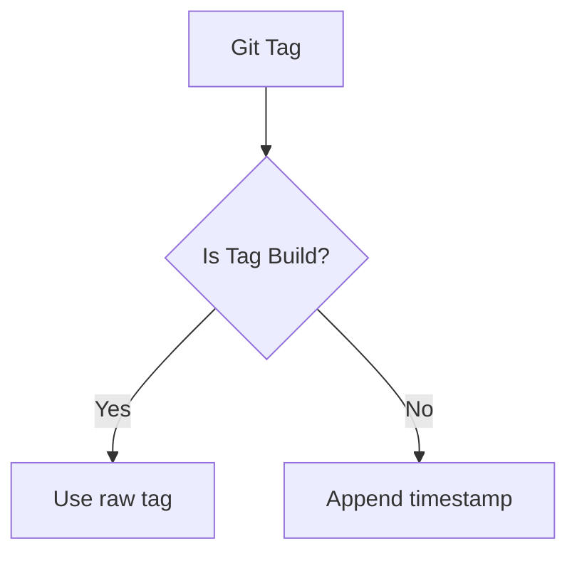

# Greengage Reusable Docker Build Workflow

[](https://docs.github.com/en/actions/using-workflows/reusing-workflows)

## Overview

This reusable GitHub Actions workflow automates the building and publishing of Greengage Database (GGDB) Docker images to GitHub Container Registry (GHCR). It supports:

- Multi-version builds (GGDB 6/7)
- Multi-OS builds (Ubuntu, CentOS, etc.)
- Base image caching
- Automatic tagging strategy
- CI repository fallback mechanism

## Usage

### Input Parameters

| Parameter | Description | Required | Default |
|-----------|-------------|----------|---------|
| `version` | GGDB version (e.g., "6" or "7") | Yes | - |
| `target_os` | Target OS (e.g., "ubuntu") | Yes | - |
| `target_os_version` | OS version (e.g., "22") | Yes | - |
| `python3` | Python3 build argument | No | `''` |

### Secrets

| Secret | Description |
|--------|-------------|
| `ghcr_token` | GitHub token with `write:packages` permission |

### Example Implementation

```yaml
name: Build main Branch 6.x

on:
  push:
    branches:
      - 'main'
    tags:
      - '6.*'

jobs:
  build-v6-centos7:
    uses: greengagedb/greengage-ci/.github/workflows/greengage-reusable-build.yml@main
    with:
      version: 6
      target_os: centos
      target_os_version: 7
      python3: ''
    secrets:
      ghcr_token: ${{ secrets.GITHUB_TOKEN }}

  build-v6-ubuntu22:
    uses: greengagedb/greengage-ci/.github/workflows/greengage-reusable-build.yml@main
    with:
      version: 6
      target_os: ubuntu
      target_os_version: 22
      python3: python3
    secrets:
      ghcr_token: ${{ secrets.GITHUB_TOKEN }}

```

## Workflow Steps

### 1. Repository Setup

- Checks out main repository with submodules
- Creates CI directory structure
- Checks out CI repository or falls back to local `ci/` directory

### 2. Docker Configuration

- Sets up Docker Buildx
- Authenticates to GitHub Container Registry

### 3. Base Image Build

- Pulls previous base image for caching (if available)
- Builds and pushes OS-specific base image using:

  ```Dockerfile
  ci/Dockerfile.ubuntu22
  ```

### 4. Tag Management



### 5. Final Image Build

- Builds GGDB image with structure:

  ```text
  ghcr.io/<org>/<repo>/ggdb7_ubuntu22:<tag>
  ```

- Uses multi-layer caching:
  1. Base image layer
  2. Previous release image
- For tagged releases:
  - Additional `:latest` tag is pushed
  - No timestamp suffix added

## Image Tagging Strategy

| Git Reference | Tag Format | Example |
|---------------|------------|---------|
| Tag           | `X.Y.Z` | `7.3.0` |
| Non-tag       | `X.Y.Z-YYYYMMDDHHMM` | `v6.28.0-202506101230` |

## Requirements

1. **CI Repository Structure (example)**:

   ```bash
   ci/
   ├── Dockerfile.centos7
   └── Dockerfile.ubuntu22
   Dockerfile
   ```

2. **Base Dockerfiles**:
   - Must be named: `Dockerfile.<OS><OS_VERSION>`
   - Example: `Dockerfile.ubuntu22`

3. **Permissions**:
   - `contents: read` (for repositories)
   - `packages: write` (for GHCR)

## Failure Handling

The workflow implements smart fallbacks:

1. Remote CI repository unavailable → Uses local `ci/` directory
2. Previous images missing → Builds without cache
3. Invalid tags → Automatically generates timestamp-based tags
