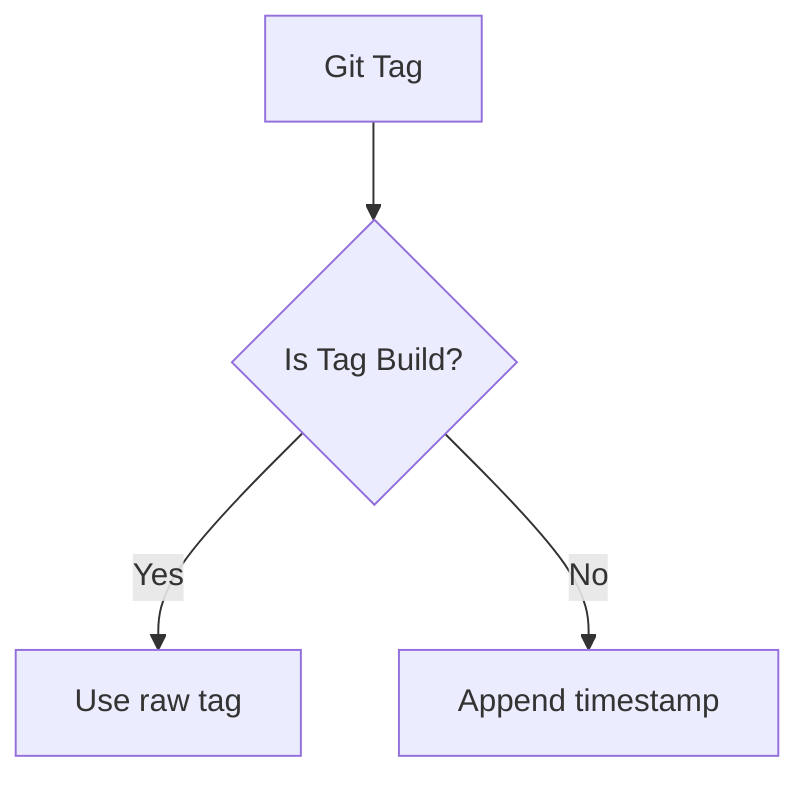

# Greengage Reusable Docker Build Workflow

[](https://docs.github.com/en/actions/using-workflows/reusing-workflows)

## Overview

This reusable GitHub Actions workflow, maintained by **GreenData**, automates the building and publishing of **Greengage Database (GGDB)** Docker images to GitHub Container Registry (GHCR). It is part of the `GreengageDB/greengage-ci` repository, a fork of `GreengageDB/greengage-ci`. The workflow supports:

- Multi-version builds (GGDB 6` or `7.x`)
- Multi-OS builds (`Ubuntu 22`, `CentOS 7`, `RockyLinux 8`)
- Python3 configuration for `Ubuntu 22` with version `6`
- Base image caching
- Automatic tagging strategy
- CI repository fallback mechanism

The `manual_build.yml` workflow allows manual triggering with a user-friendly interface to select the target branch and OS, ensuring compatibility and streamlined builds.
The `manual_build.yml` shoul be placed in target repositor at `.github/workflows/greengage-build-manual.yml`.

## Usage

### Manual Build Workflow

The `manual_build.yml` workflow is designed for manual execution via GitHub Actions' `workflow_dispatch`. It determines the Greengage version based on the selected branch and validates OS compatibility.

#### Input Parameters

| Parameter | Description | Required | Default | Options |
|-----------|-------------|----------|---------|---------|
| `target_branch` | Target branch to checkout and build | Yes | `main` | `main` (version `6`), `7.x` (version `7`) |
| `os_combination` | Target OS (must be compatible with version) | Yes | `Ubuntu 22` | `CentOS 7 (for 6.x only)`, `Ubuntu 22`, `RockyLinux 8 (for 7.x only)` |
| `logLevel` | Log level for the build | Yes | `warning` | `info`, `warning`, `debug` |
| `debug_mode` | Enable debug mode | No | `false` | `true`, `false` |

#### Version Mapping

- Branch `main` → Version `6`
- Branch `7.x` → Version `7`

#### OS Compatibility

- Version `6`: Compatible with `CentOS 7 (for 6.x only)` and `Ubuntu 22`
- Version `7`: Compatible with `RockyLinux 8 (for 7.x only)` and `Ubuntu 22`

#### Python3 Configuration

- `python3=python3` (command name) is set for `Ubuntu 22` with version `6`.
- Empty (`python3=`) for all other combinations.

#### Example Implementation

To trigger a manual build, use the following configuration in `.github/workflows/manual_build.yml` within the `GreengageDB/greengage` repository:

```yaml
name: Greengage Manual Build

on:
  workflow_dispatch:
    inputs:
      target_branch:
        description: 'Target branch to checkout and build'
        required: true
        default: 'main'
        type: choice
        options:
          - '7.x'
          - 'main'
      os_combination:
        description: 'Target OS (MUST be compatible with Version)'
        required: true
        default: 'Ubuntu 22'
        type: choice
        options:
          - 'CentOS 7 (for 6.x only)'
          - 'Ubuntu 22'
          - 'RockyLinux 8 (for 7.x only)'
      logLevel:
        description: 'Log level'
        required: true
        default: 'warning'
        type: choice
        options:
          - info
          - warning
          - debug
      debug_mode:
        description: 'Enable debug mode'
        type: boolean
        default: false

jobs:
  parse-os:
    runs-on: ubuntu-latest
    outputs:
      target_os: ${{ steps.parse_os.outputs.target_os }}
      target_os_version: ${{ steps.parse_os.outputs.target_os_version }}
      python3: ${{ steps.parse_os.outputs.python3 }}
      version: ${{ steps.parse_os.outputs.version }}
    steps:
      - name: Parse OS combination
        id: parse_os
        run: |
          # Set version based on target_branch
          case "${{ inputs.target_branch }}" in
            "main")
              version="6"
              ;;
            "7.x")
              version="7"
              ;;
          esac
          echo "version=$version" >> $GITHUB_OUTPUT

          # Validate OS combination and parse
          case "${{ inputs.os_combination }}" in
            "CentOS 7 (for 6.x only)")
              if [[ "$version" != "6" ]]; then
                echo "Error: CentOS 7 is only compatible with version 6" >&2
                exit 1
              fi
              echo "target_os=centos" >> $GITHUB_OUTPUT
              echo "target_os_version=7" >> $GITHUB_OUTPUT
              echo "python3=" >> $GITHUB_OUTPUT
              ;;
            "Ubuntu 22")
              echo "target_os=ubuntu" >> $GITHUB_OUTPUT
              echo "target_os_version=22" >> $GITHUB_OUTPUT
              if [[ "$version" == "6" ]]; then
                echo "python3=python3" >> $GITHUB_OUTPUT
              else
                echo "python3=" >> $GITHUB_OUTPUT
              fi
              ;;
            "RockyLinux 8 (for 7.x only)")
              if [[ "$version" != "7" ]]; then
                echo "Error: RockyLinux 8 is only compatible with version 7" >&2
                exit 1
              fi
              echo "target_os=rockylinux" >> $GITHUB_OUTPUT
              echo "target_os_version=8" >> $GITHUB_OUTPUT
              echo "python3=" >> $GITHUB_OUTPUT
              ;;
          esac

  manual-build:
    needs: parse-os
    uses: GreengageDB/greengage-ci/.github/workflows/greengage-reusable-build.yml@main
    with:
      version: ${{ needs.parse-os.outputs.version }}
      target_os: ${{ needs.parse-os.outputs.target_os }}
      target_os_version: ${{ needs.parse-os.outputs.target_os_version }}
      python3: ${{ needs.parse-os.outputs.python3 }}
      ref: ${{ inputs.target_branch }}
    secrets:
      ghcr_token: ${{ secrets.GITHUB_TOKEN }}
```

### Reusable Workflow Inputs

The `greengage-reusable-build.yml` workflow accepts the following inputs:

| Parameter | Description | Required | Default |
|-----------|-------------|----------|---------|
| `version` | GGDB version (e.g., `6` or `7`) | Yes | - |
| `target_os` | Target OS (e.g., `ubuntu`, `centos`, `rockylinux`) | Yes | - |
| `target_os_version` | OS version (e.g., `22`, `7`, `8`) | Yes | - |
| `python3` | Python3 build argument (e.g., `python3` or empty) | No | `''` |
| `ref` | Branch or ref to checkout | No | `''` |

### Secrets

| Secret | Description |
|--------|-------------|
| `ghcr_token` | GitHub token with `write:packages` permission |

### Example for Automated Builds

For automated builds triggered by `push` or `tag` events, you can configure workflows like this:

```yaml
name: Greengage Auto Build

on:
  push:
    tags: ['6.*']
  pull_request:
    branches: ['*']
    tags: ['6.*']

jobs:
  build-v6-centos7:
    uses: magf/greengage-ci/.github/workflows/greengage-reusable-build.yml@main
    with:
      version: 6
      target_os: centos
      target_os_version: 7
      python3: ''
    secrets:
      ghcr_token: ${{ secrets.GITHUB_TOKEN }}

  build-v6-ubuntu22:
    uses: magf/greengage-ci/.github/workflows/greengage-reusable-build.yml@main
    with:
      version: 6
      target_os: ubuntu
      target_os_version: 22
      python3: python3
    secrets:
      ghcr_token: ${{ secrets.GITHUB_TOKEN }}
```

## Workflow Steps

### 1. Repository Setup

- Checks out the main repository (`GreengageDB/greengage`) with the specified branch (`ref`) or default branch if `ref` is empty
- Creates CI directory structure
- Checks out the CI repository (`GreengageDB/greengage-ci`) or falls back to local `ci/` directory

### 2. Docker Configuration

- Sets up Docker Buildx
- Authenticates to GitHub Container Registry

### 3. Base Image Build

- Pulls previous base image for caching (if available)
- Builds and pushes OS-specific base image using:

  ```Dockerfile
  ci/Dockerfile.<target_os><target_os_version>
  ```

  Example: `ci/Dockerfile.ubuntu22`

### 4. Tag Management



### 5. Final Image Build

- Builds GGDB image with structure:

  ```text
  ghcr.io/GreengageDB/greengage/ggdb<version>_<target_os><target_os_version>:<tag>
  ```

  Example: `ghcr.io/GreengageDB/greengage/ggdb6_ubuntu22:6.28.0`

- Uses multi-layer caching:
  1. Base image layer
  2. Previous release image
- For tagged releases:
  - Additional `:latest` tag is pushed
  - No timestamp suffix added
- Includes build arguments:
  - `PYTHON3`: Set to `python3` for `Ubuntu 22` with version `6`, otherwise empty
  - `REPO`, `TARGET_OS`, `TARGET_OS_VERSION`

## Image Tagging Strategy

| Git Reference | Tag Format | Example |
|---------------|------------|---------|
| Tag           | `X.Y.Z` | `7.3.0` |
| Non-tag       | `X.Y.Z-YYYYMMDDHHMM` | `6.28.0-202506101230` |

## Requirements

1. **CI Repository Structure**:

   ```bash
   ci/
   ├── Dockerfile.centos7
   ├── Dockerfile.ubuntu22
   ├── Dockerfile.rockylinux8
   └── ...
   Dockerfile
   ```

2. **Base Dockerfiles**:
   - Must be named: `Dockerfile.<target_os><target_os_version>`
   - Examples: `Dockerfile.ubuntu22`, `Dockerfile.centos7`, `Dockerfile.rockylinux8`

3. **Permissions**:
   - `contents: read` (for repositories)
   - `packages: write` (for GHCR)

## Failure Handling

The workflow implements smart fallbacks:

1. Remote CI repository (`GreengageDB/greengage-ci`) unavailable → Uses local `ci/` directory
2. Previous images missing → Builds without cache
3. Invalid tags → Automatically generates timestamp-based tags

## Contributing

This workflow is maintained by **GreenData** in the `GreengageDB/greengage-ci` repository. For issues or contributions, please open a pull request or issue at:

- [GreengageDB/greengage-ci](https://github.com/GreengageDB/greengage-ci)

For Greengage Database development, refer to:

- [GreengageDB/greengage](https://github.com/GreengageDB/greengage)
